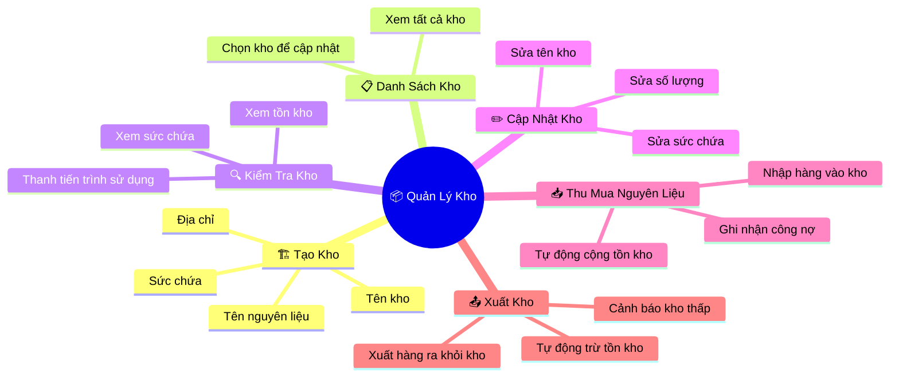
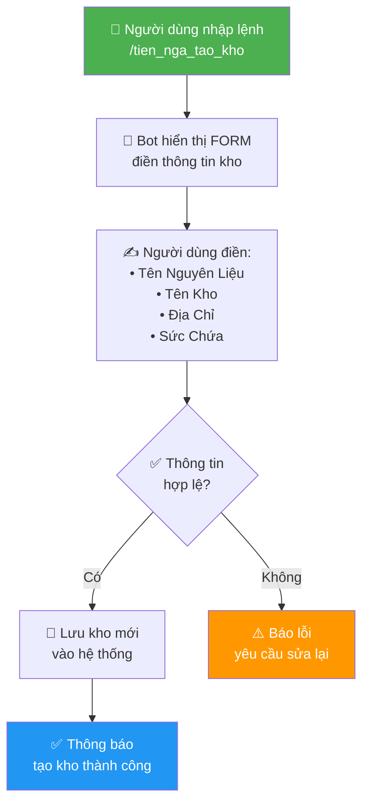
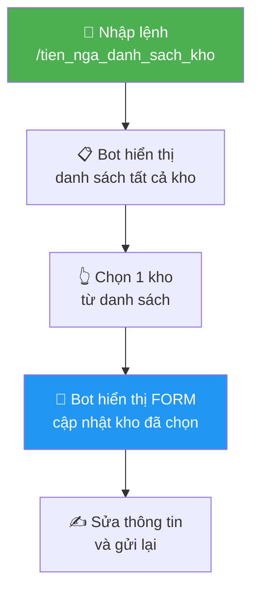
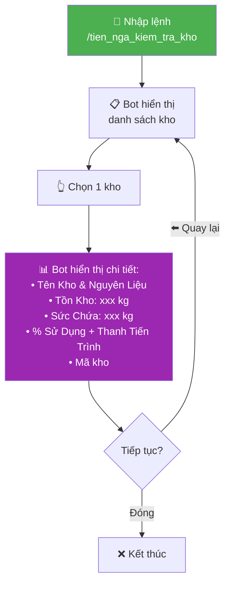
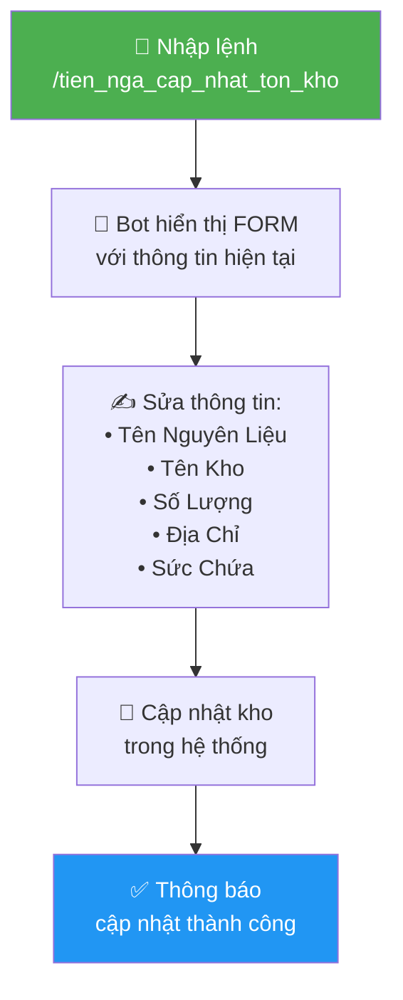
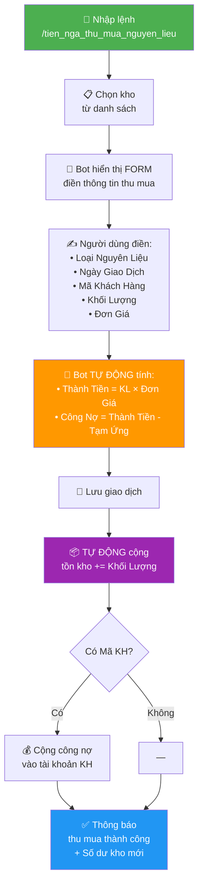
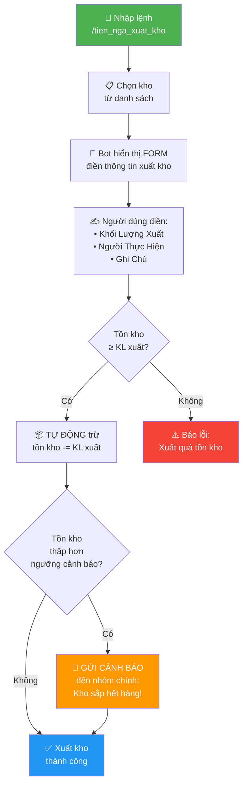
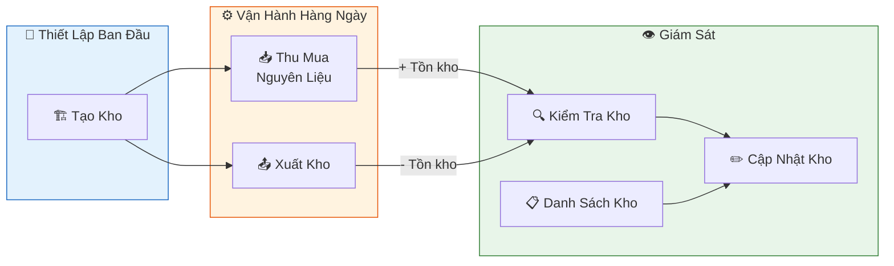

# 📦 Sơ Đồ Tư Duy — Hệ Thống Quản Lý Kho Tiến Nga

## Tổng quan hệ thống

---

## Quy trình hoạt động chi tiết

### 1. 🏗️ Tạo Kho Mới (`/tien_nga_tao_kho`)

> **Mục đích:** Tạo một kho mới để chứa nguyên liệu (Acid, Củi, Cao su, v.v.)

---

### 2. 📋 Danh Sách Kho (`/tien_nga_danh_sach_kho`)

> **Mục đích:** Xem tất cả kho và chọn kho để cập nhật thông tin

---

### 3. 🔍 Kiểm Tra Kho (`/tien_nga_kiem_tra_kho`)

> **Mục đích:** Xem nhanh tình trạng tồn kho của từng kho — bao nhiêu kg, còn bao nhiêu phần trăm sức chứa

---

### 4. ✏️ Cập Nhật Tồn Kho (`/tien_nga_cap_nhat_ton_kho`)

> **Mục đích:** Điều chỉnh trực tiếp số lượng tồn kho hoặc thông tin kho (dùng khi kiểm kê thực tế)

---

### 5. 📥 Thu Mua Nguyên Liệu (`/tien_nga_thu_mua_nguyen_lieu`)

> **Mục đích:** Ghi nhận nhập hàng vào kho — tự động tính tiền, cộng tồn kho, và ghi công nợ cho khách hàng

---

### 6. 📤 Xuất Kho (`/tien_nga_xuat_kho`)

> **Mục đích:** Ghi nhận xuất hàng ra khỏi kho — tự động trừ tồn kho và cảnh báo nếu kho sắp hết

---

## Luồng tổng thể

---

## Bảng tóm tắt

| Lệnh | Chức năng | Ai dùng? | Tác động |
|---|---|---|---|
| `/tien_nga_tao_kho` | Tạo kho mới | Owner, Admin | Thêm kho vào hệ thống |
| `/tien_nga_danh_sach_kho` | Xem & chọn kho | Owner, Admin | Hiển thị form cập nhật |
| `/tien_nga_kiem_tra_kho` | Kiểm tra tồn kho | Owner, Admin | Xem chi tiết, % sức chứa |
| `/tien_nga_cap_nhat_ton_kho` | Cập nhật số liệu kho | Owner, Admin | Sửa trực tiếp tồn kho |
| `/tien_nga_thu_mua_nguyen_lieu` | Nhập hàng vào kho | Owner, Admin | **+** Tồn kho, **+** Công nợ KH |
| `/tien_nga_xuat_kho` | Xuất hàng ra khỏi kho | Owner, Admin | **-** Tồn kho, cảnh báo nếu thấp |

> [!TIP]
> **Thu mua** = hàng vào kho (tồn kho **tăng**) · **Xuất kho** = hàng ra khỏi kho (tồn kho **giảm**)
