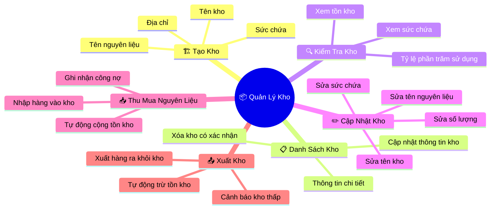
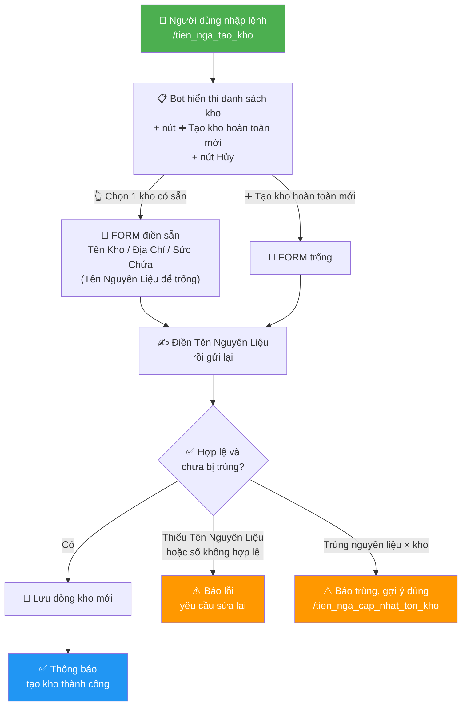
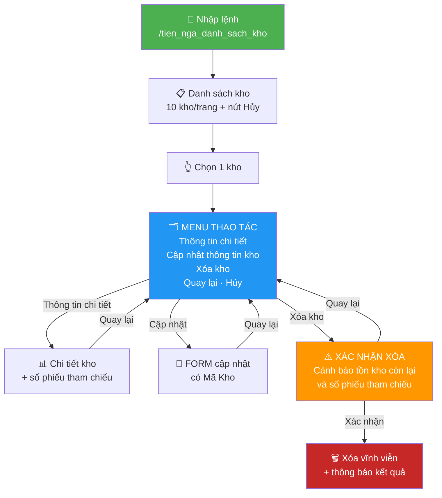
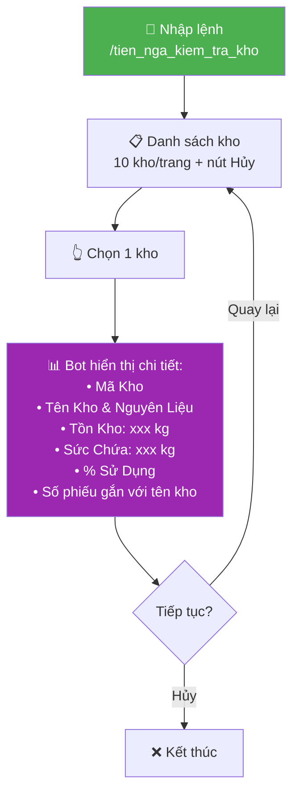
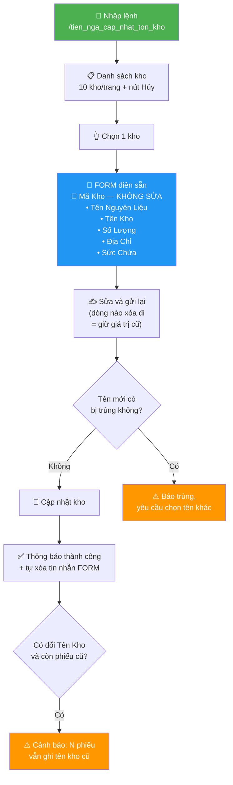
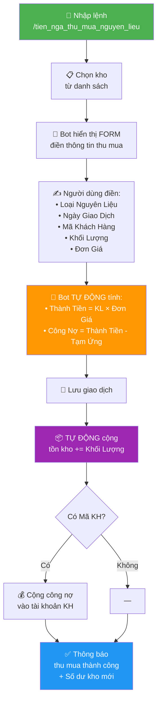
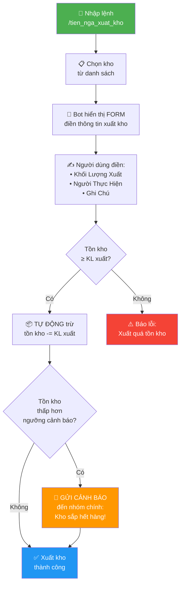
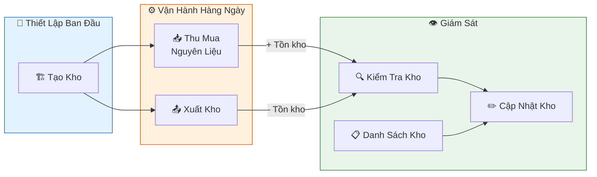

# 📦 Sơ Đồ Tư Duy — Hệ Thống Quản Lý Kho Tiến Nga

## Tổng quan hệ thống

```mermaid
mindmap
  root((📦 Quản Lý Kho))
    🏗️ Tạo Kho
      Tên nguyên liệu
      Tên kho
      Địa chỉ
      Sức chứa
    📋 Danh Sách Kho
      Thông tin chi tiết
      Cập nhật thông tin kho
      Xóa kho có xác nhận
    🔍 Kiểm Tra Kho
      Xem tồn kho
      Xem sức chứa
      Tỷ lệ phần trăm sử dụng
    ✏️ Cập Nhật Kho
      Sửa tên nguyên liệu
      Sửa tên kho
      Sửa số lượng
      Sửa sức chứa
    📥 Thu Mua Nguyên Liệu
      Nhập hàng vào kho
      Ghi nhận công nợ
      Tự động cộng tồn kho
    📤 Xuất Kho
      Xuất hàng ra khỏi kho
      Tự động trừ tồn kho
      Cảnh báo kho thấp
```

---

## Quy trình hoạt động chi tiết

### 1. 🏗️ Tạo Kho Mới (`/tien_nga_tao_kho`)

```mermaid
flowchart TD
    A["👤 Người dùng nhập lệnh\n/tien_nga_tao_kho"] --> B["📋 Bot hiển thị danh sách kho\n+ nút ➕ Tạo kho hoàn toàn mới\n+ nút Hủy"]
    B -- "👆 Chọn 1 kho có sẵn" --> C["📝 FORM điền sẵn\nTên Kho / Địa Chỉ / Sức Chứa\n(Tên Nguyên Liệu để trống)"]
    B -- "➕ Tạo kho hoàn toàn mới" --> D["📝 FORM trống"]
    C --> E["✍️ Điền Tên Nguyên Liệu\nrồi gửi lại"]
    D --> E
    E --> F{"✅ Hợp lệ và\nchưa bị trùng?"}
    F -- Có --> G["💾 Lưu dòng kho mới"]
    G --> H["✅ Thông báo\ntạo kho thành công"]
    F -- "Thiếu Tên Nguyên Liệu\nhoặc số không hợp lệ" --> I["⚠️ Báo lỗi\nyêu cầu sửa lại"]
    F -- "Trùng nguyên liệu × kho" --> J["⚠️ Báo trùng, gợi ý dùng\n/tien_nga_cap_nhat_ton_kho"]

    style A fill:#4CAF50,color:#fff
    style H fill:#2196F3,color:#fff
    style I fill:#FF9800,color:#fff
    style J fill:#FF9800,color:#fff
```

> **Mục đích:** Tạo một dòng kho mới để chứa nguyên liệu (Acid, Củi, Cao su, v.v.)
> **Mẹo:** chọn kho có sẵn để thêm nguyên liệu mới vào kho đó mà không phải gõ lại thông tin kho.

---

### 2. 📋 Danh Sách Kho (`/tien_nga_danh_sach_kho`)

```mermaid
flowchart TD
    A["👤 Nhập lệnh\n/tien_nga_danh_sach_kho"] --> B["📋 Danh sách kho\n10 kho/trang + nút Hủy"]
    B --> C["👆 Chọn 1 kho"]
    C --> D["🗂️ MENU THAO TÁC\nThông tin chi tiết\nCập nhật thông tin kho\nXóa kho\nQuay lại · Hủy"]
    D -- "Thông tin chi tiết" --> E["📊 Chi tiết kho\n+ số phiếu tham chiếu"]
    D -- "Cập nhật" --> F["📝 FORM cập nhật\ncó Mã Kho"]
    D -- "Xóa kho" --> G["⚠️ XÁC NHẬN XÓA\nCảnh báo tồn kho còn lại\nvà số phiếu tham chiếu"]
    G -- "Xác nhận" --> H["🗑️ Xóa vĩnh viễn\n+ thông báo kết quả"]
    G -- "Quay lại" --> D
    E -- "Quay lại" --> D
    F -- "Quay lại" --> D

    style A fill:#4CAF50,color:#fff
    style D fill:#2196F3,color:#fff
    style G fill:#FF9800,color:#fff
    style H fill:#C62828,color:#fff
```

> **Mục đích:** Xem và quản lý từng kho — thông tin, cập nhật, xóa.
> **⚠️ Xóa là vĩnh viễn** (bảng `inventories` không có cột trạng thái nên không xóa mềm được).
> Cảnh báo chỉ để nhắc, không chặn. Nút `Xác nhận` chống bấm trùng.

---

### 3. 🔍 Kiểm Tra Kho (`/tien_nga_kiem_tra_kho`)

```mermaid
flowchart TD
    A["👤 Nhập lệnh\n/tien_nga_kiem_tra_kho"] --> B["📋 Danh sách kho\n10 kho/trang + nút Hủy"]
    B --> C["👆 Chọn 1 kho"]
    C --> D["📊 Bot hiển thị chi tiết:\n• Mã Kho\n• Tên Kho & Nguyên Liệu\n• Tồn Kho: xxx kg\n• Sức Chứa: xxx kg\n• % Sử Dụng\n• Số phiếu gắn với tên kho"]
    D --> E{"Tiếp tục?"}
    E -- "Quay lại" --> B
    E -- "Hủy" --> F["❌ Kết thúc"]

    style A fill:#4CAF50,color:#fff
    style D fill:#9C27B0,color:#fff
```

> **Mục đích:** Xem nhanh tình trạng tồn kho của từng kho — bao nhiêu kg, còn bao nhiêu phần trăm sức chứa
> **Phân quyền:** lệnh duy nhất trong nhóm mở thêm cho `main_supplier`.

---

### 4. ✏️ Cập Nhật Tồn Kho (`/tien_nga_cap_nhat_ton_kho`)

```mermaid
flowchart TD
    A["👤 Nhập lệnh\n/tien_nga_cap_nhat_ton_kho"] --> B["📋 Danh sách kho\n10 kho/trang + nút Hủy"]
    B --> C["👆 Chọn 1 kho"]
    C --> D["📝 FORM điền sẵn\n🔑 Mã Kho — KHÔNG SỬA\n• Tên Nguyên Liệu\n• Tên Kho\n• Số Lượng\n• Địa Chỉ\n• Sức Chứa"]
    D --> E["✍️ Sửa và gửi lại\n(dòng nào xóa đi\n= giữ giá trị cũ)"]
    E --> F{"Tên mới có\nbị trùng không?"}
    F -- Không --> G["💾 Cập nhật kho"]
    F -- Có --> H["⚠️ Báo trùng,\nyêu cầu chọn tên khác"]
    G --> I["✅ Thông báo thành công\n+ tự xóa tin nhắn FORM"]
    I --> J{"Có đổi Tên Kho\nvà còn phiếu cũ?"}
    J -- Có --> K["⚠️ Cảnh báo: N phiếu\nvẫn ghi tên kho cũ"]

    style A fill:#4CAF50,color:#fff
    style D fill:#2196F3,color:#fff
    style H fill:#FF9800,color:#fff
    style K fill:#FF9800,color:#fff
```

> **Mục đích:** Điều chỉnh trực tiếp số lượng tồn kho hoặc thông tin kho (dùng khi kiểm kê thực tế)
>
> **Ba điều cần nhớ:**
> 1. `Mã Kho` là khóa tìm bản ghi — **đừng sửa**. Nhờ nó mới đổi được `Tên Nguyên Liệu` và `Tên Kho`.
> 2. **Dòng nào xóa khỏi form hoặc để trống thì giữ nguyên giá trị cũ.** Muốn đặt tồn kho về 0 phải ghi rõ `Số Lượng: 0`.
> 3. Đổi `Tên Kho` khiến phiếu thu mua / xuất kho cũ vẫn ghi tên cũ, vì chúng lưu tên kho **dạng chữ, không phải khóa ngoại**.

---

### 5. 📥 Thu Mua Nguyên Liệu (`/tien_nga_thu_mua_nguyen_lieu`)

```mermaid
flowchart TD
    A["👤 Nhập lệnh\n/tien_nga_thu_mua_nguyen_lieu"] --> B["📋 Chọn kho\ntừ danh sách"]
    B --> C["📝 Bot hiển thị FORM\nđiền thông tin thu mua"]
    C --> D["✍️ Người dùng điền:\n• Loại Nguyên Liệu\n• Ngày Giao Dịch\n• Mã Khách Hàng\n• Khối Lượng\n• Đơn Giá"]
    D --> E["🤖 Bot TỰ ĐỘNG tính:\n• Thành Tiền = KL × Đơn Giá\n• Công Nợ = Thành Tiền - Tạm Ứng"]
    E --> F["💾 Lưu giao dịch"]
    F --> G["📦 TỰ ĐỘNG cộng\ntồn kho += Khối Lượng"]
    G --> H{"Có Mã KH?"}
    H -- Có --> I["💰 Cộng công nợ\nvào tài khoản KH"]
    H -- Không --> J["—"]
    I --> K["✅ Thông báo\nthu mua thành công\n+ Số dư kho mới"]
    J --> K

    style A fill:#4CAF50,color:#fff
    style E fill:#FF9800,color:#fff
    style G fill:#9C27B0,color:#fff
    style K fill:#2196F3,color:#fff
```

> **Mục đích:** Ghi nhận nhập hàng vào kho — tự động tính tiền, cộng tồn kho, và ghi công nợ cho khách hàng

---

### 6. 📤 Xuất Kho (`/tien_nga_xuat_kho`)

```mermaid
flowchart TD
    A["👤 Nhập lệnh\n/tien_nga_xuat_kho"] --> B["📋 Chọn kho\ntừ danh sách"]
    B --> C["📝 Bot hiển thị FORM\nđiền thông tin xuất kho"]
    C --> D["✍️ Người dùng điền:\n• Khối Lượng Xuất\n• Người Thực Hiện\n• Ghi Chú"]
    D --> E{"Tồn kho\n≥ KL xuất?"}
    E -- Có --> F["📦 TỰ ĐỘNG trừ\ntồn kho -= KL xuất"]
    E -- Không --> G["⚠️ Báo lỗi:\nXuất quá tồn kho"]
    F --> H{"Tồn kho\nthấp hơn\nngưỡng cảnh báo?"}
    H -- Có --> I["🚨 GỬI CẢNH BÁO\nđến nhóm chính:\nKho sắp hết hàng!"]
    H -- Không --> J["✅ Xuất kho\nthành công"]
    I --> J

    style A fill:#4CAF50,color:#fff
    style G fill:#f44336,color:#fff
    style I fill:#FF9800,color:#fff
    style J fill:#2196F3,color:#fff
```

> **Mục đích:** Ghi nhận xuất hàng ra khỏi kho — tự động trừ tồn kho và cảnh báo nếu kho sắp hết

---

## Luồng tổng thể

```mermaid
flowchart LR
    subgraph THIẾT_LẬP["🔧 Thiết Lập Ban Đầu"]
        A["🏗️ Tạo Kho"]
    end
    
    subgraph VẬN_HÀNH["⚙️ Vận Hành Hàng Ngày"]
        B["📥 Thu Mua\nNguyên Liệu"]
        C["📤 Xuất Kho"]
    end
    
    subgraph GIÁM_SÁT["👁️ Giám Sát"]
        D["🔍 Kiểm Tra Kho"]
        E["📋 Danh Sách Kho"]
        F["✏️ Cập Nhật Kho"]
    end

    A --> B
    A --> C
    B -->|"+ Tồn kho"| D
    C -->|"- Tồn kho"| D
    D --> F
    E --> F

    style THIẾT_LẬP fill:#E3F2FD,stroke:#1565C0
    style VẬN_HÀNH fill:#FFF3E0,stroke:#E65100
    style GIÁM_SÁT fill:#E8F5E9,stroke:#2E7D32
```

---

## Bảng tóm tắt

| Lệnh | Chức năng | Ai dùng? | Tác động |
|---|---|---|---|
| `/tien_nga_tao_kho` | Tạo dòng kho mới | Owner, Admin | Thêm dòng kho, chặn trùng nguyên liệu × kho |
| `/tien_nga_danh_sach_kho` | Quản lý kho | Owner, Admin | Xem chi tiết · Cập nhật · **Xóa vĩnh viễn** |
| `/tien_nga_kiem_tra_kho` | Kiểm tra tồn kho | Owner, Admin, **Thu mua** | Chỉ đọc — chi tiết, % sức chứa |
| `/tien_nga_cap_nhat_ton_kho` | Cập nhật số liệu kho | Owner, Admin | Sửa mọi trường theo `Mã Kho` |
| `/tien_nga_thu_mua_nguyen_lieu` | Nhập hàng vào kho | Owner, Admin | **+** Tồn kho, **+** Công nợ KH |
| `/tien_nga_xuat_kho` | Xuất hàng ra khỏi kho | Owner, Admin | **-** Tồn kho, cảnh báo nếu thấp |

> [!TIP]
> **Thu mua** = hàng vào kho (tồn kho **tăng**) · **Xuất kho** = hàng ra khỏi kho (tồn kho **giảm**)

> [!IMPORTANT]
> **Mỗi dòng kho là một cặp (nguyên liệu × tên kho).** Hệ thống không có bảng kho riêng — "kho" chỉ
> là cột chữ `storage_name` lặp lại. Một kho vật lý chứa 3 loại nguyên liệu sẽ hiện thành **3 dòng**.
>
> Hệ quả: phiếu thu mua / xuất kho / giao dịch thành phẩm tham chiếu kho bằng **tên dạng chữ, không
> phải khóa ngoại**. Vì vậy đổi `Tên Kho` khiến các phiếu cũ vẫn ghi tên cũ (bot có cảnh báo), còn
> xóa một dòng kho thì lịch sử phiếu vẫn đọc được bình thường.
